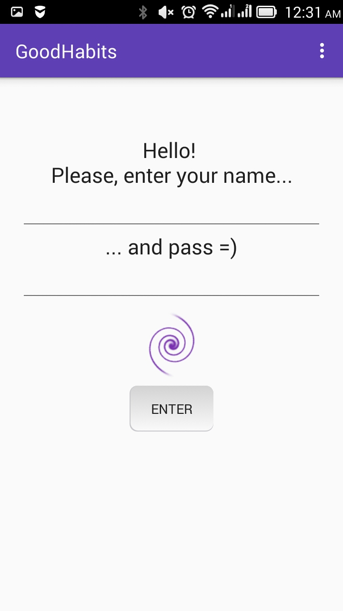
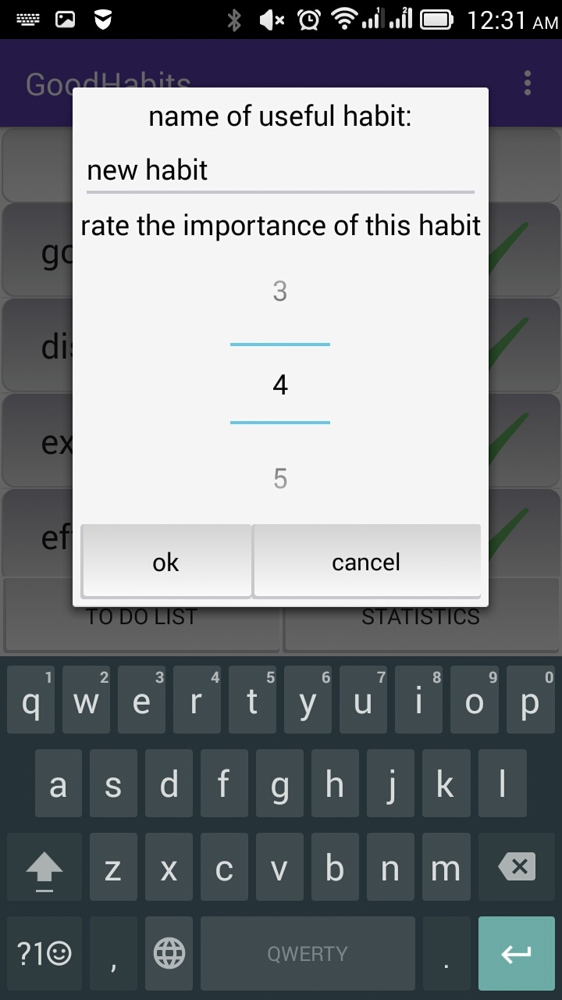
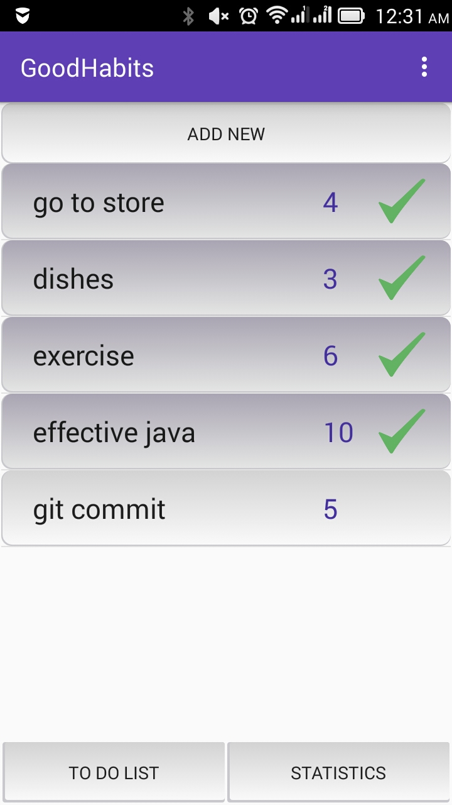
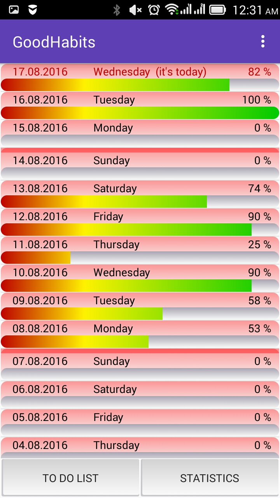

# GoodHabits

## What is this application for?

This application is designed for developing good habits and self-discipline.

## Key android mechanics:

+ SQLite, 
+ Fragments, 
+ ListViews with custom adapters, 
+ simple Animation, 
+ AsyncTask...

## Features:
You start use this app with creating your own account, that can be protected with password. There may be many accounts that will work parallel.

After that you can work with your own list of habits, add new, remove, change name or rating of some habit.

You also can mark some habits as done or as undone in list today. Every day at 12:00 pm habits list reset.

All information about previous days you can see in statistics fragment. Daily ranking is formed according to the rating of each habit.

This application supports English, Russian and Ukrainian languages

## [Download APK](bin/app-release.apk)
